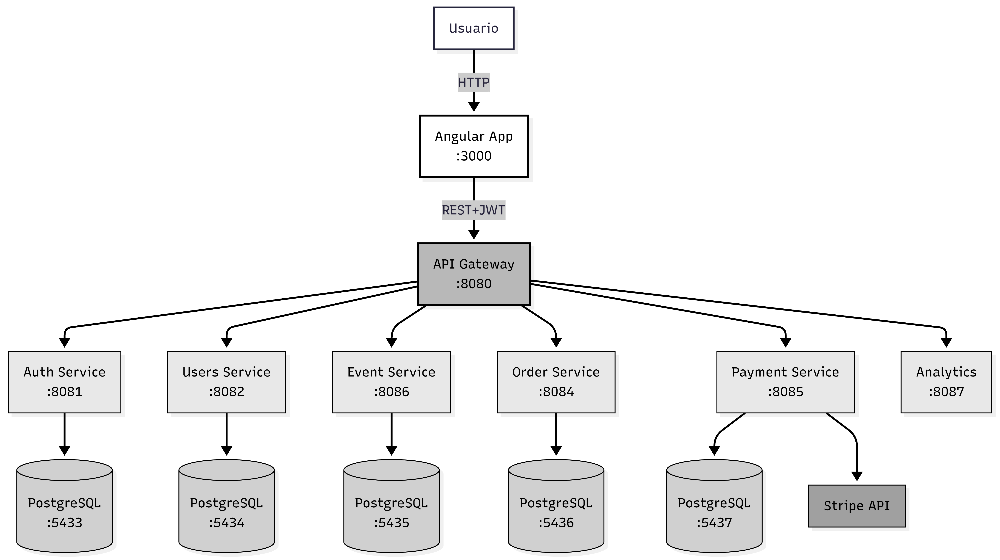
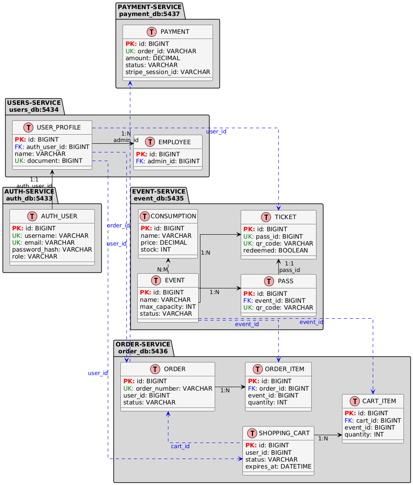
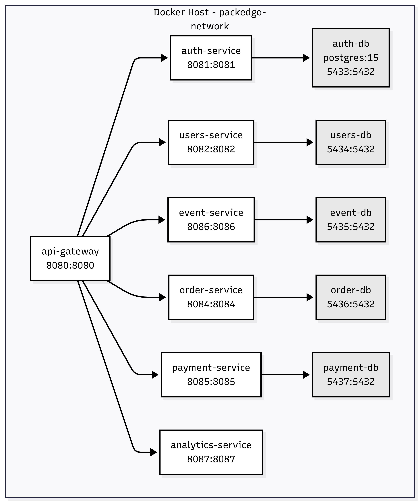

# 🎟️ PackedGo: Event Management SaaS

**PackedGo** is a comprehensive SaaS platform designed to optimize the management and sale of event tickets and on-site consumptions. It unifies access control and sales via a single QR code system.

> ⚠️ **Note:** This repository is a technical showcase. The source code is private as it is a proprietary commercial product. This document outlines the architecture and engineering decisions.

---

## 🚀 Technical Overview

The system is built on a **Microservices Architecture** to ensure modularity and scalability.

* **Frontend:** Angular 19.2.0 (Responsive Web Client)
* **Backend:** Java 17, Spring Boot (Microservices)
* **Database:** PostgreSQL 15 (Database-per-Service Pattern)
* **Infrastructure:** Docker, Docker Compose
* **Integrations:** Stripe API (Payments), ZXing (QR Scanning)
* **Security:** JWT Authentication (Role-based: ADMIN, EMPLOYEE, CUSTOMER)

---

## 🏗️ System Architecture

The solution is composed of **6 isolated microservices** communicating via HTTP/REST behind an API Gateway.

| Service | Port | Function |
| :--- | :--- | :--- |
| **Auth** | 8081 | JWT issuance, Role management |
| **Users** | 8082 | Profile management & Employee access |
| **Event** | 8086 | Event catalog, Tickets, & QR Validation |
| **Order** | 8084 | Shopping cart & Order processing |
| **Payment** | 8085 | Stripe integration & Async Webhooks |
| **Analytics** | 8087 | Real-time dashboards for organizers |

### High-Level Architecture (C4 Model)

*(Figure 1: Container diagram showing microservices and external integrations)*

---

## 💾 Data Modeling

We implemented the **Database-per-Service** pattern to ensure loose coupling. Each microservice owns its schema. Consistency is managed through logical references and orchestrated business flows.

### Logical Entity-Relationship Diagram

*(Figure 3: Independent schemas for Auth, Users, Events, Orders, and Payments)*

---

## 🔄 Key Workflows

### 1. Purchase & Async Payments (Stripe)
Handling distributed transactions was a key challenge. The system uses a state machine to handle **Stripe Webhooks** asynchronously, ensuring consistency even if the user closes the browser.

*(Figure 4: Sequence diagram handling 400/500 errors and webhook confirmation)*

### 2. On-Site QR Validation
Staff members (EMPLOYEE role) use the app to scan user QR codes. The system validates the ticket validity and decrements consumption stock in real-time.

---

## 🛠️ Infrastructure & Deployment

The local environment is orchestrated using **Docker Compose**, creating a dedicated network (`packedgo-network`) for all services and databases.

---

### 📬 Contact
**Agustin Luparia** - Co-Founder & Full Stack Engineer
[LinkedIn Profile](https://www.linkedin.com/in/agustin-luparia)
